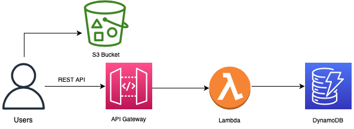
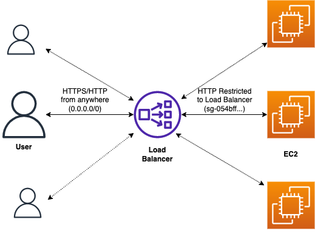

# The AWS Essentials 

### Contents
 1.  [Setting up the CLI](https://github.com/blessinvarkey/musings/blob/wip-1/posts/cloud/aws/theory/19-01-2022-exploring-aws-services.md#setting-up-the-cli)
 2. [IAM Security Tools](https://github.com/blessinvarkey/musings/blob/wip-1/posts/cloud/aws/theory/19-01-2022-exploring-aws-services.md#iam-security-tools) 
 3. [IAM Role](https://github.com/blessinvarkey/musings/blob/wip-1/posts/cloud/aws/theory/19-01-2022-exploring-aws-services.md#iam-role) 
 4. [IAM Policies](https://github.com/blessinvarkey/musings/blob/wip-1/posts/cloud/aws/theory/19-01-2022-exploring-aws-services.md#iam-policies) 
 5. [IAM Permissions](https://github.com/blessinvarkey/musings/blob/wip-1/posts/cloud/aws/theory/19-01-2022-exploring-aws-services.md#iam-permissions) 
 6. [Setting up an EC2 Instance](https://github.com/blessinvarkey/musings/blob/wip-1/posts/cloud/aws/theory/19-01-2022-exploring-aws-services.md#setting-up-an-ec2-instance)  
 7. [EBS Volume & Snapshot](https://github.com/blessinvarkey/musings/blob/wip-1/posts/cloud/aws/theory/19-01-2022-exploring-aws-services.md#ebs-volume--snapshot)  
 8. [Lambda](https://github.com/blessinvarkey/musings/blob/wip-1/posts/cloud/aws/theory/19-01-2022-exploring-aws-services.md#lambda)  

## 1. Setting up the CLI
To get started, first download the CLI. I've shared the details for installing on Mac, for Windows and Linux, you can find the installation details [here](https://docs.aws.amazon.com/cli/latest/userguide/getting-started-install.html).

For Mac, installation via terminal:

```
"https://awscli.amazonaws.com/AWSCLIV2.pkg" -o "AWSCLIV2.pkg"
```
```
sudo installer -pkg AWSCLIV2.pkg -target /      

```
```
which aws
```
```
aws --version
```

#### a. IAM Management Console  
Users> Security Credentials> Access Keys> Download .csv file (or save them)

```
aws configure
```
```
AWS Access Key ID: (input access id)
AWS Secret Access Key: (input access key)
Default region name [selected-region-name]: (return or enter region name)
Default output format [None]: (return or enter json)
```

## 2. IAM Security Tools

### a. Credential Report (account level)
Report with details of account's users and status of their various credentials.  

IAM Management Console> Credential Report
 
### b. Access Advisor (user level)
Access advisor shows the service permissions granted to a user and when those services were last accessed. 

IAM Management Console> Users> Access Advisor


## 3. IAM Role
An IAM Role is an IAM entity that defines a set of permissions for making requests to AWS services and will be used by an AWS service. 

## 4. IAM Policies
IAM Policies are JSON documents that define a set of permissions for making requests to AWS services, and can be used by IAM users, User Groups and IAM Roles

### a. Policy structure
```
{
      "Version": "2012-10-17",
      "Id": " ", #identfier for the policy (optional)
      "Statement": [ #an identifier for the policy (optional)
            {
                  "Sid": "1",  # an identifier for the statement (optional)
                  "Effect": "Allow", # whether the statement allows or denies access 
                  "Principal": { #account/user/role to which this policy applied to 
                        "AWS: ["arn:aws:iam::123456789012:root"]},
                  "Action":["s3:GetObject", #list of actions this policy allows or denies
                  "s3:PutObject"],
                  "Resource": ["arn:aws:s3::mybucket/*"]
            }
      ]

}
```

## 5. IAM Permissions
Grant Least Privilege 


## 6. Setting up an EC2 Instance

1. Choose an AMI (Linux 2)
2. Choose an Instance type (t2.micro)
3. Configure Instance Details
4. Add Storage 
5. Add Tags
6. Configure security group
7. Review instance launch 

```
chmod 0400 KEYPAIR.pem 
```
```
shh -i KEYPAIR.pem ec2-user@IPV4address
```
If you selected Amazon Linux, you should now be able to see: 

       __|  __|_  )
       _|  (     /   Amazon Linux 2 AMI
      ___|\___|___|


```
whoami
```
The whoami command should give the output: ec2-user

## 7. EBS volume & Snapshot

Select Instance> Storage> Select Volume ID> Create Volume > GiB size (2)> Availability Zone (same as instance name)> Create Volume


## 8. Lambda



### a. Major Integrations
- API Gateway
- DynamoDB
- S3
- SNS
- SQS
- Kinesis
- CloudFront 
- CloudWatch EventBridge 
- CloudWatch Logs
- Cognito

### b. Flow example
Example flow of uploading an image on the s3 bucket to generate a thumbnail image of the same.


### c. Lambda function example 

Lambda> Create function> Author from scratch> function name> runtime> create fn
```
def lambda_handler(event, context):
      print(event['key1])
      return 'Hello from Lambda!'
```


### d. Invocations
#### i. Syncronous 

- Result is returned right away
- User invoked 
- Elastic Load balancing, API Gateway, CloudFront, S3 batch, Cognito, Step Functions, Lex, Alexa, Kinesis Data Firehose

```
invoke
--function-name <value>
[--invocation-type <value>]
[--log-type <value>]
[--client-context <value>]
[--payload <value>]
[--qualifier <value>]
<outfile>
----

aws lambda invoke \
    --function-name my-function \
    --payload '{ "name": "Bob" }' \
    response.json
```

### e. CLI

```
aws lambda invoke --function-name lambda-1 --cli-binary-format raw-in-base64-out --payload'{"key1":"value1", "key2":"value2"}'  
```

### f. Functions in the region
```
aws lambda list-functions
```
### g. EC2 vs Lambda 

|EC2|Lambda|
|--|--|
|Virtual Servers in the Cloud| Virtual functions - no servers to manage |
|Limited by RAM and CPU|Limited by time - short executions|
|Continously running|Run-on-demand|
|Scaling means intervention to add/remove servers||

## 9. SQS & SNS
### SQS
- unlimited messages in queue
- Message stays for 4 days, maximum 14 
- Limitation of 256KB per message sent
- Producer sends message to SQS (SendMessageAPI)
- Consumer pulls message from SQS (upto 10 messages at a time)
- Consumer deletes messages using DeleteMessageAPI

## 10. Elastic Load Balancer
Load Balancers are servers that forward traffic to multiple servers. 

An Elastic Load Balancer is a managed load balancer (AWS ensures that it will take care of the upgrades, maintainance and availability)
- Cheaper to set a load balancer, but requires more effort
- ELB can be integrated with: EC2, EC2 Auto Scaling Groups, Amazon ECS, AWS Certificate Manager, CloudWatch, Route53, AWS WAF, AWS Global Accelerator



### a. Load Balancer Security groups

|Security Group|Type|Port Range|Source|
|--|--|--|--|
|Load Balancer|HTTP/S|40/443|0.0.0.0/0 (from anywhere)|
|Application|HTTP|80|sg-05..(load balancer)|

- __Classic Load Balancer (CLB)__: HTTP, HTTPS, TCP, SSL
- __Application Load Balancer (ALB)__: HTTP, HTTPS, WebSocket
- __Network Load Balancer__: NLB, TCP, TLS, UDP
- __Gateway Load Balancer__: Layer 3, IP Protocol


