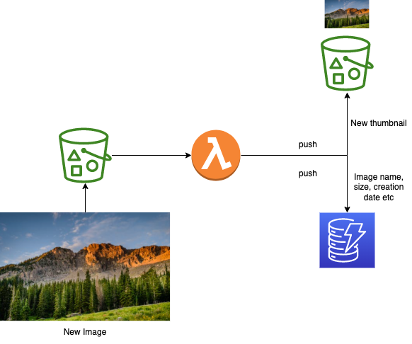

# AWS Exploration


## Setting up CLI
For Mac, installation via terminal:

```
"https://awscli.amazonaws.com/AWSCLIV2.pkg" -o "AWSCLIV2.pkg"
```
```
sudo installer -pkg AWSCLIV2.pkg -target /      

```
```
which aws
```
```
aws --version
```

#### On your IAM Management Console:  
Users> Security Credentials> Access Keys> Download .csv file (or save them)

```
aws configure
```
```
AWS Access Key ID: (input access id)
AWS Secret Access Key: (input access key)
Default region name [selected-region-name]: (return or enter region name)
Default output format [None]: (return or enter json)
```

## IAM Security Tools

### 1. Credential Report (account level)
Report with details of account's users and status of their various credentials.  

IAM Management Console> Credential Report
 
### 2. Access Advisor (user level)
Access advisor shows the service permissions granted to a user and when those services were last accessed. 

IAM Management Console> Users> Access Advisor


## IAM Role
An IAM Role is an IAM entity that defines a set of permissions for making requests to AWS services and will be used by an AWS service. 

## IAM Policies
IAM Policies are JSON documents that define a set of permissions for making requests to AWS services, and can be used by IAM users, User Groups and IAM Roles

### Policy structure
```
{
      "Version": "2012-10-17",
      "Id": " ", #identfier for the policy (optional)
      "Statement": [ #an identifier for the policy (optional)
            {
                  "Sid": "1",  # an identifier for the statement (optional)
                  "Effect": "Allow", # whether the statement allows or denies access 
                  "Principal": { #account/user/role to which this policy applied to 
                        "AWS: ["arn:aws:iam::123456789012:root"]},
                  "Action":["s3:GetObject", #list of actions this policy allows or denies
                  "s3:PutObject"],
                  "Resource": ["arn:aws:s3::mybucket/*"]
            }
      ]

}
```

## IAM Permissions
Grant Least Privilege 


## Setting up an EC2 Instance

1. Choose an AMI (Linux 2)
2. Choose an Instance type (t2.micro)
3. Configure Instance Details
4. Add Storage 
5. Add Tags
6. Configure security group
7. Review instance launch 

```
chmod 0400 KEYPAIR.pem 
```
```
shh -i KEYPAIR.pem ec2-user@IPV4address
```
If you selected Amazon Linux, you should now be able to see: 

       __|  __|_  )
       _|  (     /   Amazon Linux 2 AMI
      ___|\___|___|


```
whoami
```
The whoami command should give the output: ec2-user

### Setting up an EBS volume

Select Instance> Storage> Select Volume ID> Create Volume > GiB size (2)> Availability Zone (same as instance name)> Create Volume

### Setting up an EBS Snapshot


### Lambda


### Major Integrations
- API Gateway
- DynamoDB
- S3
- SNS
- SQS
- Kinesis
- CloudFront 
- CloudWatch EventBridge 
- CloudWatch Logs
- Cognito




|||
|--|--|
|EC2|Lambda|
|Virtual Servers in the Cloud| Virtual functions - no servers to manage |
|Limited by RAM and CPU|Limited by time - short executions|
|Continously running|Run-on-demand|
|Scaling means intervention to add/remove servers||

